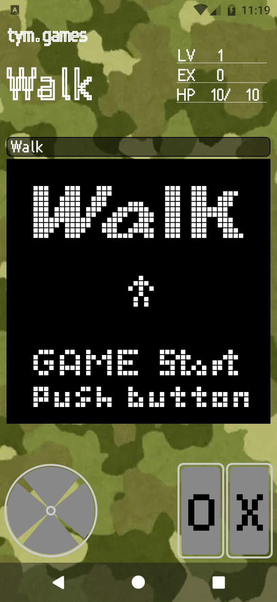
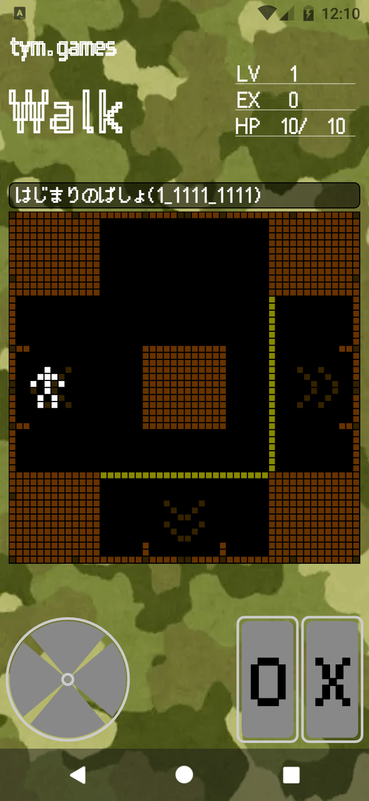
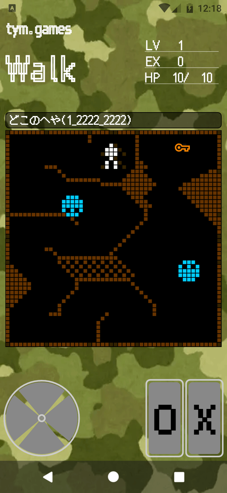
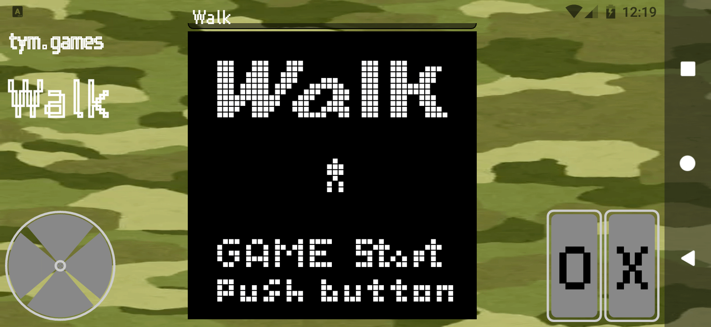
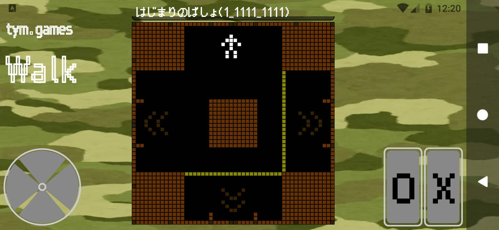
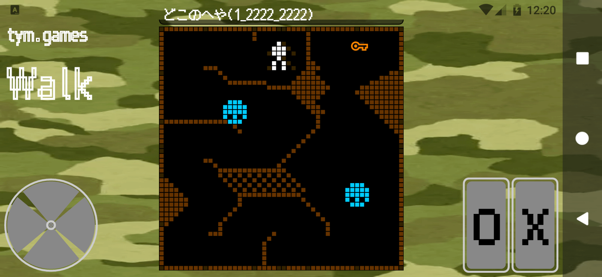

# アプリ名

tym.WALK

# 簡単な説明

キャラクタを操作してゴールを目指せ！  
さあ！ゲームスタート！！

# 更新の内容

## 2024.05.16 (1, 0.9.2)

- tym.WALK を公開しました
- 現在は開発中のためゴールはありませんが・・・

# 詳しい説明

【キャラクタを操作してゴールを目指すゲーム】

ゲームパッドとボタンを操作してどこかにあるゴールを目指してください  

# 音とキャラクタ

<pre>
https://dotown.maeda-design-room.net/ (未使用)
https://www.springin.org/sound-stock/
</pre>

---

# アプリのアイコン

※アプリアイコンは、透過 PNG または JPEG で、1 MB 以下、512 x 512 ピクセルであり、
Google の デザイン仕様と メタデータに関するポリシーを遵守する必要があります。

# フィーチャー グラフィック

※フィーチャー グラフィックは、PNG または JPEG で、15 MB 以下、1,024 x 500 ピクセルである必要があります。

# 携帯電話版のスクリーンショット

※スマートフォンのスクリーンショットを 2～8 枚アップロードしてください。
スクリーンショットは、PNG または JPEG で、それぞれ 8 MB 以下、
アスペクト比 16:9 または 9:16 で、縦横がそれぞれ 320～3,840 ピクセルである必要があります。
プロモーションの対象となるには、縦横がそれぞれ 1,080 ピクセル以上のスクリーンショットを
4 枚以上アップロードしてください。

# 7 インチ タブレット版のスクリーンショット

※ ・・・

# 10 インチ タブレット版のスクリーンショット

※ ・・・
